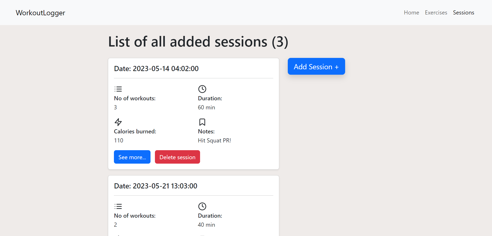
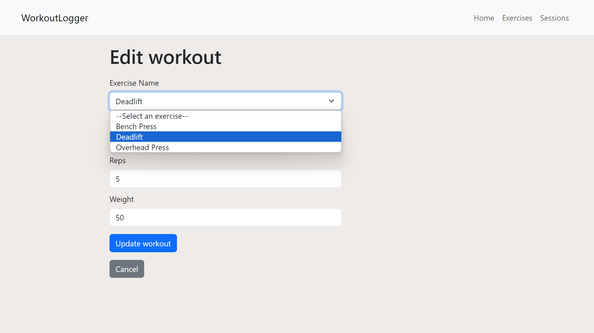
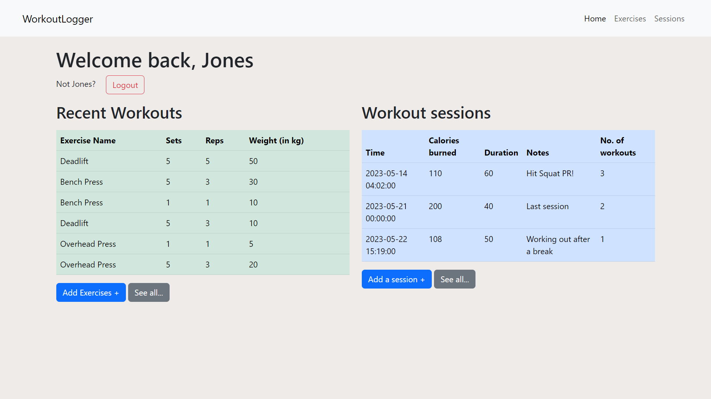

# Workout Logger

The Workout Logger is a web application developed in PHP that allows users to log their workouts and track their progress. It provides an intuitive interface for users to record their exercise details, including sets, reps, weight, and other relevant information.

Technologies used: MySQL, PHP, XAMPP & Bootstrap.css

## Features

- Logging workouts with exercise details
- User registration and authentication
- Viewing and editing past workouts
- Tracking workout duration and calories burned
- Adding notes to workouts for additional information

## Images

